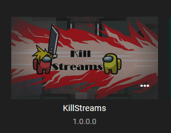
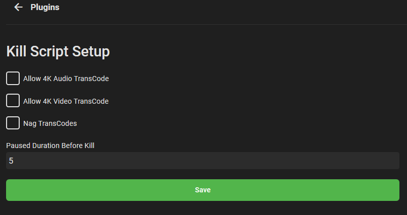
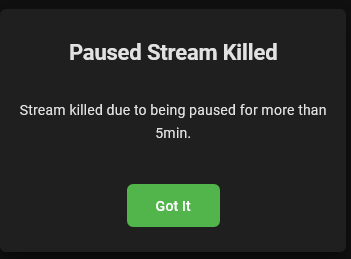

# Emby Kill Streams Plugin
This plugin offers a couple options to kill transcoding greater than 720p streams, streams that have been paused for xx min (set in config), and a fun nag warning to tell users not to transcode if set.

Plugin Image

Config Page

Paused Example

1080p Killed Example

Download and put in plugin folder .
https://github.com/CyberPoison/Emby_KillStreams/releases/download/v1/KillStreams.dll
